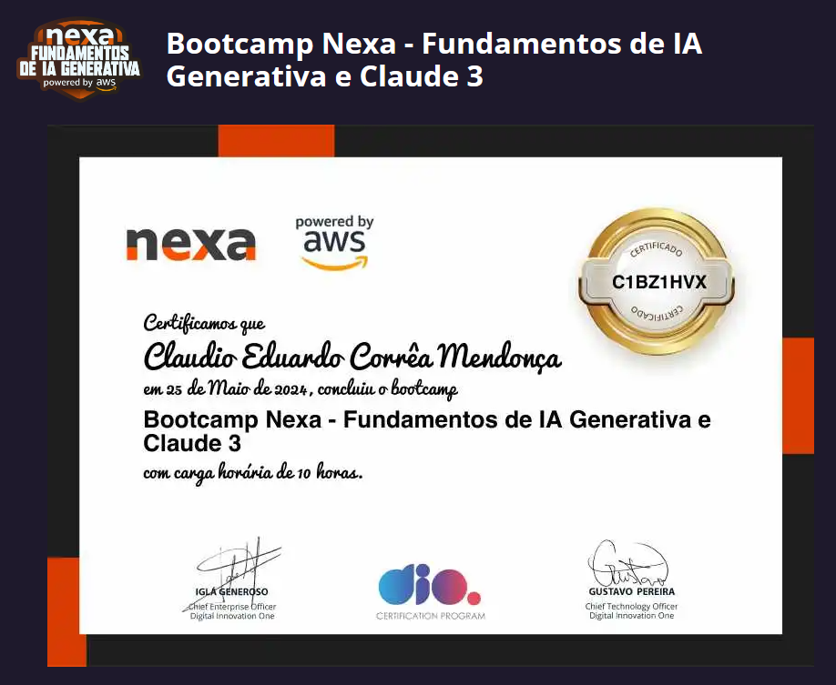

# 🎥 𝚈𝚘𝚞𝚝𝚞𝚋𝚎 Notas Detalhadas 📝

|  |
|:--:|
| O aplicativo "Youtube Notas Detalhadas" oferece aos usuários uma maneira prática de converter vídeos do YouTube com transcrição em notas detalhadas em português. Através da API do Gemini, o app traduz automaticamente o conteúdo do vídeo para o idioma desejado, gerando um resumo completo e preciso. |
|  |
|  |
|  |

# Conceito e Funcionalidades:
O app foi idealizado com o objetivo de auxiliar usuários que desejam:

- Aprender com mais eficiência a partir de vídeos do YouTube: Transformar a transcrição em notas detalhadas facilita a revisão e o aprendizado dos conteúdos assistidos.
- Acessar informações em português: A tradução automática garante que, mesmo em vídeos em outros idiomas, o conteúdo seja compreendido.
- Economizar tempo: O processo automatizado de conversão elimina a necessidade de anotações manuais demoradas.

## 🤖 Tecnologias Utilizadas
Para dar vida ao app, a seguinte pilha tecnológica foi selecionada:

- Streamlit: Framework Python para criação de interfaces web interativas. Ideal para prototipagem rápida e deploy em plataformas online.
- Python: Linguagem de programação versátil e poderosa, utilizada para o desenvolvimento da lógica principal do aplicativo.
- API do Gemini: Ferramenta crucial para converter a fala em texto e traduzir idiomas. O Gemini Pro, versão paga da API, foi utilizado para garantir maior qualidade e recursos avançados.
- API do YouTube: Permite extrair informações e transcrições dos vídeos selecionados pelos usuários.

## 🧐 Processo de Criação
O desenvolvimento do app foi realizado na IDE VSCODE, um ambiente popular para programação Python.
Hospedagem e Deploy: O código do app foi armazenado no repositório GitHub, permitindo o controle de versão e colaboração entre desenvolvedores. O deploy do app foi feito utilizando o Streamlit, que permite a hospedagem e o acesso online do aplicativo.

> [!TIP]
>O app possui uma interface simples e intuitiva, composta por apenas uma tela. O usuário precisa seguir estas etapas:
> 1.	Inserir a API Key do Gemini: No campo designado, insira a chave de API do Gemini, que permite acesso aos recursos de tradução e conversão de texto.
> 2.	Colar o link do vídeo do YouTube: No campo "Insira o link do vídeo do YouTube", copie e cole o link do vídeo que deseja converter em notas detalhadas.
> 3.	Clicar no botão "Obter notas detalhadas do vídeo": Ao clicar nesse botão, o app processa o vídeo e gera as notas detalhadas em português. O resumo é apresentado na mesma tela, pronto para ser lido ou salvo.

## 🚀 Resultados
O app "Youtube Notas Detalhadas" se destaca por sua simplicidade, funcionalidade e utilidade. A combinação de tecnologias como Streamlit, Python, API do Gemini e API do YouTube possibilitou a criação de uma ferramenta valiosa para quem busca otimizar o aprendizado e a retenção de informações a partir de vídeos do YouTube.

## 💭 Reflexão (Opcional)
O app "Youtube Notas Detalhadas" demonstra o potencial da tecnologia para facilitar o acesso à informação e otimizar o processo de aprendizado. Sua interface amigável e funcionalidades práticas o tornam uma ferramenta útil para estudantes, profissionais e qualquer pessoa que busca aproveitar ao máximo o conteúdo dos vídeos do YouTube.

## Certificado

- Bootcamp Nexa - Fundamentos de IA Generativa e Claude 3

## Licença

Copyright © 2024 <a href="https://www.claudiomendonca.eng.br" target="_blank">ClaudioMendonca.eng.br</a> .
